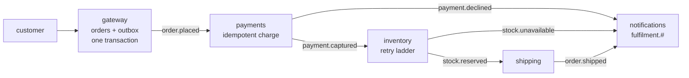

# apps/01 — order fulfilment (microservices)

Five services, one broker, no shared database, and no service that knows another
exists.

Everything before this directory demonstrates one idea at a time. This is what
they look like when they have to coexist: an outbox at the edge, idempotency
where double-charging is real harm, a retry ladder where a downstream is flaky,
and one correlation id that turns five services into one story.

## The flow



Each service owns one decision and publishes what happened. None of them calls
another.

## What each service is here to show

| Service | The pattern | Why it lives there |
|---|---|---|
| **gateway** | Transactional outbox | The edge is where the dual-write problem lives: save the order *and* announce it, or a crash loses one of them |
| **payments** | Shared idempotency store | The only service where handling a message twice is real money. Claims before charging, confirms after publishing |
| **inventory** | Retry ladder + fatal failures | Tells "the warehouse timed out" (retry) from "there are three left and they want ten" (never retry) |
| **shipping** | Nothing clever | The point: it reacts to one event, does one thing, publishes one event. Adding a service beside it changes nothing |
| **notifications** | Topic wildcard | Bound to `fulfilment.#`. Added without touching a single publisher, and the next one will be too |

## Running it

```bash
docker compose up -d          # just the broker
mvn -pl apps/01-order-fulfilment/system-test -am verify
```

The system test starts all five services in one JVM against a real RabbitMQ and
puts four orders through: one that succeeds, one where the warehouse is flaky,
one over the payment limit, and one where stock runs out.

**`-am` is not optional.** Without it Maven uses the last installed service jars
rather than rebuilding them, and you will debug behaviour that is no longer in
the source. It cost two rounds of confusion here.

## Design decisions worth arguing with

**A database per service.** The moment two services read the same table, the
deployment boundary is fiction. The gateway and payments each get their own.

**Every service applies the whole topology on start-up.** Applying it five times
is safe, and it means no service depends on another having started first — there
is no deployment order to get wrong. The alternative, each service declaring only
its own queue, means the first one to start finds nothing to publish into.

**Payments runs before inventory.** Reserving stock for an order that cannot be
paid for is how a warehouse fills with holds nobody releases.

**Money is taken before stock is confirmed available.** When stock runs out the
customer has already been charged, and the test asserts exactly that. A real
system triggers a refund here; the example leaves it visible rather than
pretending the problem does not exist. That compensation is what
[a saga](../../README.md) would add.

## The correlation id is the whole observability story

```java
Envelope.of("PaymentCaptured").correlationId(envelope.correlationId()).build()
```

Every service copies it forward. Notifications rebuilds the customer's timeline
from nothing but that id:

```
OrderPlaced → PaymentCaptured → StockReserved → OrderShipped
```

Four services that never spoke to each other, assembled into one sequence. Drop
that one line in any service and the order vanishes from the timeline — which is
also what happens to your traces and your log correlation in production.

## Two things this app found in the library

Worth recording, because it is the argument for building applications rather than
only examples:

- **The outbox relay published a payload nothing could read as a typed event.** It
  re-encoded the already-serialised payload, so what arrived was a JSON string
  containing JSON. Every one of these five services would have had to take
  `String` and parse by hand. Fixed in `0.2.5`.
- **A fan-in consumer needs the `text` codec.** `notifications` subscribes to six
  event types on one queue, so it cannot ask for a payload type. Asking for
  `String.class` without `as(Codecs.byName("text"))` hands the JSON codec an
  object and tells it to produce a String, which fails on *every* message with an
  error naming the wrong thing.

## What is deliberately not here

No HTTP. The gateway exposes `placeOrder(...)` as a method, because adding a web
framework would triple the code and demonstrate nothing about messaging. In a
real service that method body is the `@Transactional` handler behind a POST.

No Spring. The starter is not built yet; when it is, this app is the obvious
thing to port and the obvious proof it lost nothing.

No compensation. See above — the refund path is named and not implemented.

## Related

- [basic/06](../../basic/06-transactional-outbox) — the outbox on its own
- [intermediate/09](../../intermediate/09-shared-idempotency) — why the store is shared
- [basic/03](../../basic/03-retries-and-dead-letters) — the retry ladder
- [intermediate/03](../../intermediate/03-telemetry) — the trace this correlation id enables
