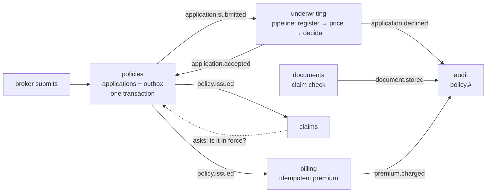

# apps/02 — policy administration (modular monolith)

One deployable, six modules, and no module on any other module's classpath.

[apps/01](../01-order-fulfilment) is five services that cannot call each other
because a network is in the way. This is the same discipline with the network
removed: the modules run in one JVM, share one database, and still communicate
only by publishing events. The boundary is a Maven dependency graph rather than a
deployment, which is weaker against a determined engineer and strong enough
against a distracted one.

**A modular monolith is not a step towards microservices.** It is a different
answer to the same question, and for most organisations the better one: you get
module boundaries without distributed transactions, independent reasoning without
independent deployment, and one database you can actually join across.

## The flow



The dotted line is the only one that is not an event: claims **asks** policies a
question and waits for the answer.

## What each module is here to show

| Module | The pattern | Why it lives there |
|---|---|---|
| **policies** | Transactional outbox | One database does *not* remove the dual write. The two systems that must agree are this database and the broker, and no transaction spans both |
| **underwriting** | `Pipeline` with described steps | The one genuinely sequential part: check the register, price it, decide. A queue per stage, so a slow stage is a deep queue you can point at |
| **documents** | Claim check | A scanned medical report is tens of megabytes. The store gets the bytes; the message gets the key |
| **billing** | Shared idempotency store | The only module where handling a message twice is money |
| **claims** | Request/reply | Needs an answer *now*, before settling. Asks over the broker even though the callee is in the same JVM |
| **audit** | Topic wildcard | Bound to `policy.#`. Every event, including ones not invented yet |

## The outbox is still necessary

This surprises people, so it is the first thing to read:

```java
connection.setAutoCommit(false);
applications.insert(connection, application);      // this database
outbox.add(OutboxRecord.of(...));                  // the same transaction
connection.commit();                               // one decision, both writes
```

A monolith removes the distributed transaction *between modules*. It does nothing
about the one between a module and its broker. Save the application and publish
the event without an outbox, and a crash between them still loses one of the two
— and the application still exists with nobody told about it.

## Why claims asks instead of reading

Claims and policies are in the same process. A method call would work. It is
still the wrong choice:

```java
Policies.PolicyStatus status = requester.request(
        "", Policies.POLICY_LOOKUP, new Policies.PolicyQuery(policyId),
        Policies.PolicyStatus.class, Duration.ofSeconds(5));
```

The moment claims calls into policies directly, the two are one module and no
package structure will separate them again. Asking over the broker costs a
millisecond and keeps the seam that makes this arrangement worth having.

Note the timeout, and note what happens when it expires: the claim is **neither
settled nor rejected**. A lookup that did not answer is not a "no", and treating
it as one would refuse valid claims whenever the application was busy.

## What writing this found

The topology was wrong, and the library said so rather than losing the messages:

```
message ... was accepted by the broker but could not be routed: nothing is
bound to exchange 'policy' for routing key 'policy.claim.settled'.
```

`claim.settled` and `document.stored` were published and nothing was bound to
them. In most clients those messages vanish silently and the bug is found weeks
later by someone asking where the audit trail went. Here it failed the test. The
`audit` queue exists because of that failure — and a regulated insurer would have
had one anyway, which is rather the point.

## Running it

```bash
docker compose -f ../01-order-fulfilment/docker-compose.yml up -d   # just the broker
mvn -pl apps/02-policy-administration/system-test -am verify
```

**`-am` is not optional**, for the same reason as apps/01: without it Maven uses
the last installed module jars rather than rebuilding them.

## What is not here yet

The claim check is a `ConcurrentHashMap` in the `documents` module, not a library
type. That is deliberate and temporary: `advanced/02` hand-rolled an encrypting
codec until `acemq-amqp-crypto` shipped, and this will move to a
`ClaimCheckStore` the same way. Getting the shape right after something real has
needed it is the opposite of how claim-check ended up advertised in a README for
months without existing.

**Retention is the part to think about before you ship one.** The store and the
queue have different lifetimes. A message replayed a month later carries a key,
and if the store expired it the replay produces a message nobody can read — worse
than a lost message, because it looks like a message.
