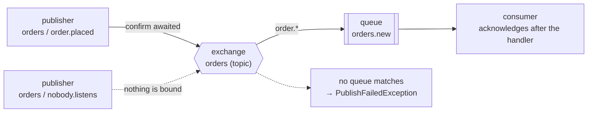

# basic/01 — publish and confirm

The smallest useful thing you can do with AceMQ: send a message, have the broker
take responsibility for it, and receive it on the other side.

## What it demonstrates

- **Publishing that waits for a confirm.** `send` does not return until RabbitMQ
  has accepted the message. A publish that fails throws rather than returning
  quietly.
- **An unroutable message is an error.** Publishing to a routing key nothing is
  bound to raises `PublishFailedException`. A typo in a routing key is the
  easiest way to lose every message you send, so it is not a silent drop.
- **Acknowledgement after the handler returns**, not on delivery. A handler that
  throws, or a process that dies mid-handler, does not lose the message.
- **JSON without being asked.** The payload is a record; nothing configures
  serialization.

## The topology it builds



The dotted path is the second half of the example: the same exchange, a routing
key with no binding, and a failure rather than silence.

## Running it

```bash
docker compose up -d
mvn compile exec:java
```

The management UI is at <http://localhost:15672> (guest/guest). Worth having open
the first time — the exchange, the queue and the binding all appear there.

## What to expect

```
  published 3f2a…-…, confirmed in PT0.004S
  consumed  o-1001 for acme, 42.00
  refused   an unroutable message, as it should
```

The confirm latency is the round trip to the broker and back. It is the cost of
knowing the message arrived, and it is why bulk publishing uses `sendAll`
(see the publishing guide).

## Then

```bash
docker compose down
```

## Related

- [Publishing](https://acemq-company.github.io/acemq-java-amqp/publishing.html)
- [Consuming](https://acemq-company.github.io/acemq-java-amqp/consuming.html)
