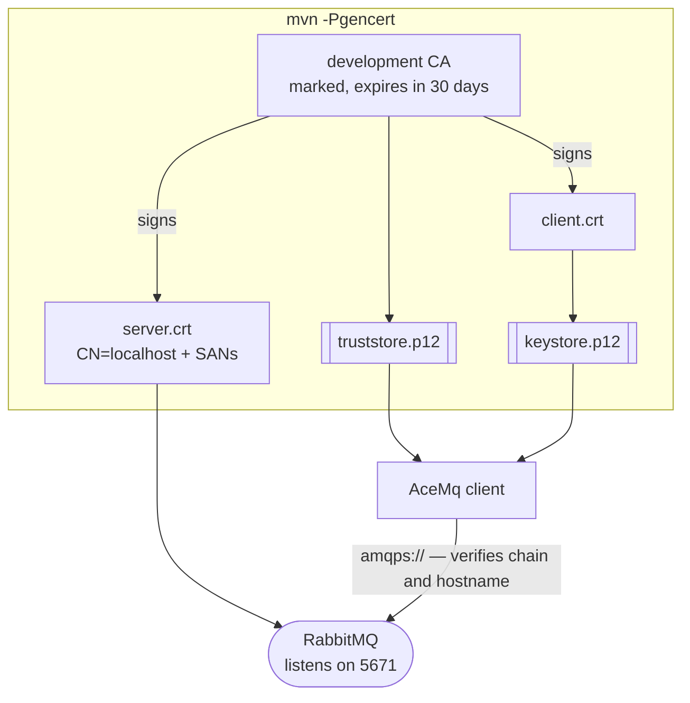

# basic/02 — TLS and credentials

Connecting over `amqps://` with certificates generated by one Maven command, and
the two things the security policy refuses to do on your behalf.

## What it demonstrates

- **Development certificates in one command.** `mvn -Pgencert` writes a
  throwaway certificate authority, a broker certificate, the keystores AceMQ
  reads, and the `rabbitmq.conf` that serves them.
- **Credentials that can rotate.** `CredentialsProvider` is consulted on every
  connection, not once at start-up, so a password changed in your secret store is
  picked up by the next reconnect rather than the next deployment.
- **`amqps://` with a disabled policy is refused.** Asking for TLS and then
  asking for no verification is a contradiction, and the library will not guess
  which half you meant.
- **Development certificates are refused unless you say otherwise.** Every
  certificate the generator writes carries `ACEMQ DEVELOPMENT ONLY - DO NOT
  TRUST`, and AceMQ rejects it unless the policy calls
  `allowDevelopmentCertificates()`.

## How the trust works



The client trusts the broker because both sides come from the same throwaway
authority. Nothing else on your machine trusts it, which is the point.

## Running it

```bash
mvn -Pgencert        # once — writes ./certs and ./certs/rabbitmq.conf
docker compose up -d
mvn compile exec:java
```

`./certs` is gitignored. Regenerate it whenever you like; the certificates expire
in thirty days by design.

## What to expect

```
  published over an encrypted connection
  consumed  o-2001 over TLS
  refused   amqps:// with verification switched off (TransportException: the URL
            asks for amqps:// and the security policy is disabled. One of the two
            is wrong…)
  refused   a development certificate without the opt-in (CertificateException:
            this chain contains a development certificate, whose signing key is
            not a secret…)
```

Both refusals are the example working. They are asserted in the test on their
*reason*, not on the fact that something threw — a test happy with any exception
would pass just as well against an unreachable broker.

## What this is not

Mutual TLS. The broker does not ask the client for a certificate here, which is
the common arrangement: you verify the server. The generated `keystore.p12`
holds a client identity ready for it — set `ssl_options.verify = verify_peer` and
`fail_if_no_peer_cert = true` in `certs/rabbitmq.conf` to turn it on.

And **none of this belongs in production.** The signing key sits next to the
certificates and is not a secret. The marker is what makes that safe: these fail
closed anywhere that has not explicitly opted in.

## Then

```bash
docker compose down
```

## Related

- [Security](https://acemq-company.github.io/acemq-java-amqp/security.html)
