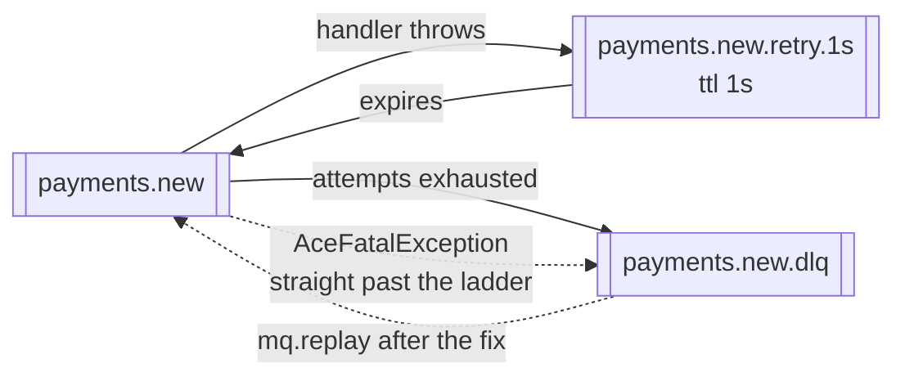

# basic/03 — retries and dead letters

What happens when a handler fails. Three scenarios in one run: a failure that
recovers, one that never does, and one that was never going to.

## What it demonstrates

- **Retries happen in the broker, not in your process.** The policy builds a
  ladder of queues with a time-to-live; a failed message waits in one and is
  dead-lettered back when it expires. No thread sleeps, so a retry storm cannot
  exhaust a pool — and retries survive a restart of your service.
- **A message that exhausts its attempts is not lost.** It goes to
  `payments.new.dlq` with the reason on its envelope.
- **`AceFatalException` skips the ladder.** A payment with a negative amount will
  be negative on every attempt; saying so turns three pointless retries into one
  rejection.

## What the ladder looks like



The queues are created for you from the policy. `RetryPolicy.fixed(3, 1s)` makes
one rung; `RetryPolicy.exponential(5, 1s, 5m)` makes as many distinct delays as
the schedule needs and no more.

## Running it

```bash
docker compose up -d
mvn compile exec:java
```

Watch <http://localhost:15672> while it runs — the retry queue and the
dead-letter queue appear as the example creates them, and you can see the
message sitting in the rung.

## What to expect

```
  recovered  after attempts [1, 2, 3], retried 2 time(s)
  gave up    after 3 attempts, 1 dead-lettered
  parked     1 message(s) waiting in payments.new.dlq
  refused    a hopeless message after 1 attempt, not 3
  dlq now    holds 2 message(s)
```

The exact attempt numbers vary with timing; the shape does not.

## Then what

The dead-lettered messages are still there. Once the cause is fixed:

```java
mq.replay("payments.new").replayAll();
```

puts them back. A dedicated replay example is still to come; the
[reliability guide](https://acemq-company.github.io/acemq-java-amqp/reliability.html#replay)
covers it in the meantime.

## Then

```bash
docker compose down
```

## Related

- [Reliability](https://acemq-company.github.io/acemq-java-amqp/reliability.html)
