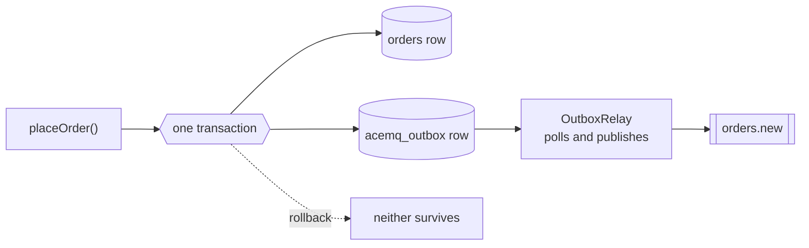

# basic/06 — transactional outbox

Saving an order and publishing an event are two writes to two systems. Done in
sequence, a crash in between leaves one done and the other not — an order nobody
was told about, or a notification for an order that does not exist. Retrying does
not help: the process that would retry is the one that died.

## What it demonstrates

- **One write, not two.** The message is inserted in the *same database
  transaction* as the order, using the connection the application is already
  holding. It becomes durable exactly when the order does.
- **A rollback takes the message with it.** The example places a second order and
  rolls it back. Neither the row nor the event survives — there is no window in
  which one exists without the other.
- **The relay publishes afterwards**, separately, often in another process.



## The consumer is an ordinary typed one

```java
mq.consume("orders.new", OrderPlaced.class, message -> ...)
```

An outbox stores a payload that is **already serialised** — that is what made it
safe to write inside the transaction — and the relay puts those bytes on the wire
unchanged. So what arrives is the JSON that was committed, and it is read like
any other message.

That was not always true, and the history is worth knowing if you are on an older
version. The relay used to republish the stored payload *through the ordinary
codec*, encoding it a second time: what arrived was a JSON string containing
JSON, `OrderPlaced.class` failed with "no String-argument constructor", and the
only thing that could read the queue was a consumer taking `String` and parsing
it by hand. It was found by building the order fulfilment app, where five
services would all have had to do that.

## Running it

```bash
docker compose up -d
mvn compile exec:java
```

H2 runs in memory inside the process; only RabbitMQ needs the container.

## What to expect

```
  committed  order o-1 and its event, in one transaction
  rolled back order o-2 — neither the row nor the event survived
  in the db  orders=1, outbox rows pending=1
  published  [o-1 o-1 42.0]
  outbox now pending=0
```

## The other half

The outbox gives you at-least-once: the relay may publish a message twice if it
dies between publishing and marking the row done. Pair it with
[basic/05](../05-idempotent-consumer) — the outbox makes sure the message is
*sent*, and the idempotent consumer makes sure it is *handled once*.

## Then

```bash
docker compose down
```

## Related

- [Reliability](https://acemq-company.github.io/acemq-java-amqp/reliability.html#the-transactional-outbox)
