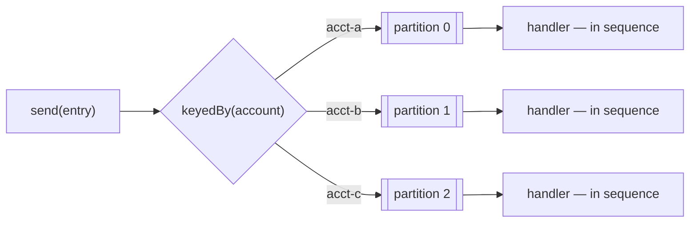

# basic/08 — ordered consumption, per key

Two entries for the same account must be applied in the order they were sent, or
the balance is wrong. Two entries for *different* accounts have no such
relationship, and making them wait for each other costs throughput for nothing.

The usual answers are both bad. One consumer with prefetch 1 orders everything
and scales to one message at a time. Many consumers on one queue scale and
reorder. Partitioning gives you both: order within a key, parallelism across
keys.

## What it demonstrates

- **`keyedBy(...)` decides what "in order" means.** Every entry for one account
  is routed to one partition and handled in sequence.
- **Different accounts run in parallel** — the example prints the number of
  threads that did the work, because ordering achieved by doing everything
  serially would look identical from the outside.
- **`onFailure(STOP)`** halts the one partition that failed and leaves the others
  running. Skipping past a failure would mean applying entry 4 after entry 3 was
  lost, which is exactly the outcome the ordering was for.



## Partitions are the concurrency limit

`partitions(4)` means at most four entries are being handled at once, whatever
the queue depth. It is also, for now, permanent in a way the code does not make
obvious: **changing the count changes which key lands where**, so a key in flight
during the change can be handled out of order. Pick a number above your expected
concurrency and leave it alone; if you must change it, drain first.

A key busier than the rest — one enormous account — makes its partition the
bottleneck no matter how many partitions there are. Ordering per key means one
key is one worker.

## Running it

```bash
docker compose up -d
mvn compile exec:java
```

## What to expect

```
  acct-a   [1, 2, 3, 4, 5, 6, 7, 8, 9, 10]  in order: true
  acct-b   [1, 2, 3, 4, 5, 6, 7, 8, 9, 10]  in order: true
  acct-c   [1, 2, 3, 4, 5, 6, 7, 8, 9, 10]  in order: true
  handled by 3 threads, so the accounts ran in parallel
```

`acct-a` is deliberately slower than the others. Without it the three accounts
might finish in send order by luck, and the example would prove nothing.

## When you do not need this

Most queues do not. If handlers are idempotent and commutative — "set the status
to shipped", "add 5 to a counter" — order does not matter and a plain consumer is
simpler and faster. Reach for ordering when applying the messages in the wrong
sequence gives a different answer.

## Then

```bash
docker compose down
```

## Related

- [Consuming — ordering](https://acemq-company.github.io/acemq-java-amqp/consuming.html#ordering)
