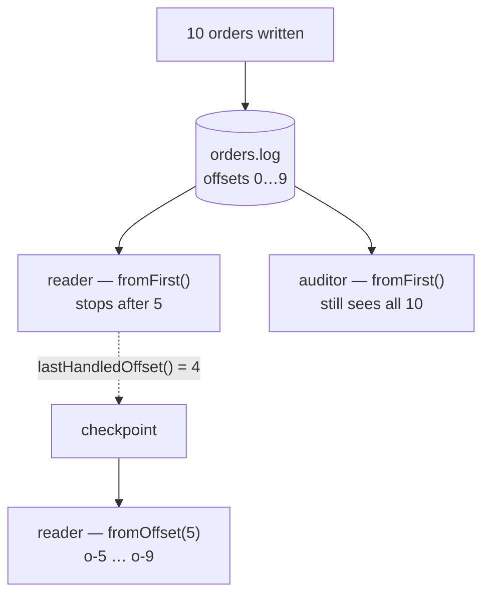

# basic/09 — streams

A queue is destructive: a consumer takes a message and it is gone. A stream is an
append-only log the broker keeps until retention removes it. Reading one does not
empty it, every reader holds its own position, and a consumer written next month
can read everything written today.

## What it demonstrates

- **Retention is the argument that matters.** `declareStream(name, maxAge,
  maxLengthBytes)` accepts `null` for both, which is legal and almost always
  wrong — a stream with no limit grows until the disk is full, and a full disk is
  a broker-wide alarm that blocks every publisher on the node.
- **Checkpointing is yours.** The broker does not remember anybody's position.
  The reader records `lastHandledOffset()`; the application stores it and resumes
  from **one past it**.
- **A failure stops the reader** rather than skipping the message. There is no
  dead-letter queue on a stream, and a projection with a hole in it is wrong in a
  way nothing later notices.
- **Reading did not consume.** A third reader attaches at the end and still sees
  all ten.



## Say where to start

A reader that is not told reads from `fromNext()`. That is right for a consumer
joining a live system and silently wrong for a projection being built, which
would skip its own history and look perfectly healthy while being empty. State
the position; do not inherit it.

## No plugin needed

Stream queues are part of RabbitMQ from 3.9 onwards. The `rabbitmq_stream`
plugin serves a separate, faster stream protocol on port 5552, which this library
does not use — so the plain `rabbitmq:4-management` image is enough.

## Running it

```bash
docker compose up -d
mvn compile exec:java
```

## What to expect

```
  wrote      10 orders to the log
  read       5, then the reader stopped
  checkpoint offset 4, saved by the reader itself
  resumed    [o-5, o-6, o-7, o-8, o-9]
  a new reader still saw all 10
```

The log line from the library on the way through is worth reading — it names the
offset to resume from, which is exactly what the example then does.

## Exactly once, if you want it

Save the checkpoint **in the same transaction as the projection's own writes**.
Anywhere else and the pair is at-least-once, which is fine when the handler is
idempotent and quietly wrong when it is not. See
[basic/05](../05-idempotent-consumer).

## When not to use one

Streams give up nearly every failure-handling tool in this library, because those
are all built on *moving* a message: retry ladders, dead-letter queues, replay,
the parking lot. If a bad message should end up somewhere a human can look at it,
you want a queue. Streams are for logs that get replayed — projections, audit
trails, event sourcing.

## Then

```bash
docker compose down
```

## Related

- [Streams](https://acemq-company.github.io/acemq-java-amqp/streams.html)
