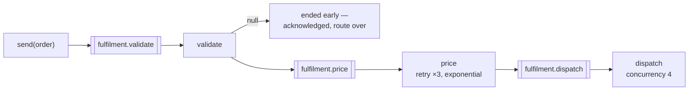

# basic/10 — pipelines

Three steps with a queue between each pair, rather than three handlers calling
one another.

Chaining handlers inside one process is function composition wearing a messaging
costume: a crash loses the work in flight, a slow step blocks everything behind
it, and scaling is all or nothing. With a queue between the steps, a crash leaves
the message where it was, a slow step grows its own queue while the others carry
on, and the step that needs four consumers gets four while its neighbour keeps
one.

## What it demonstrates

- **The type moves along the chain.** `step("price", Priced.class, ...)` means
  the next step receives a `Priced`. A step producing the wrong type is a compile
  error rather than something the broker discovers at three in the morning.
- **Returning `null` ends the route.** A filtering step is one that sometimes
  returns nothing: the message is acknowledged, nothing downstream sees it, and
  it is counted as `endedEarly` — apart from both success and failure, because a
  rejected order is a decision, not an error.
- **Retries and concurrency are per step**, because the reasons differ. A tax
  service that times out is worth retrying; a validation rule is not.
- **One queue per step**, so a backlog names the step that is slow.



## The cost, stated plainly

Every hop is a network round trip and a durable write. Three steps is three
publishes and three confirms. Where each step is microseconds of CPU, a method
call is the right tool and this is not. Reach for a pipeline when the steps have
genuinely different failure modes, different speeds, or different scaling needs.

Every hop is also at-least-once: a step sees the same message twice whenever a
publish succeeds and its acknowledgement does not. Put an idempotency store on
the steps where repeating the work would matter — `.idempotent(store)`, and see
[basic/05](../05-idempotent-consumer).

## Running it

```bash
docker compose up -d
mvn compile exec:java
```

## What to expect

```
  steps      [validate, price, dispatch]
  queues     [fulfilment.validate, fulfilment.price, fulfilment.dispatch]
  dispatched [TRK-o-1, TRK-o-2, TRK-o-3, TRK-o-4, TRK-o-5, TRK-o-6, TRK-o-7, TRK-o-8]
  rejected   [o-free] at validate, and never priced
  counts     entered=9 completed=8 endedEarly=1
```

Nine orders in, eight out. The ninth stopped at the first step and cost nothing
downstream.

## Where a message is going travels with it

Nothing here coordinates. Each step reads a routing slip carried on the message
and publishes to whatever is next — there is no orchestrator holding state, and
so nothing to lose when one dies.

## Then

```bash
docker compose down
```

## Related

- [Consuming](https://acemq-company.github.io/acemq-java-amqp/consuming.html)
- [Reliability](https://acemq-company.github.io/acemq-java-amqp/reliability.html)
