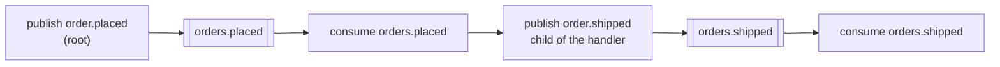

# intermediate/03 — telemetry and tracing

An order takes nine seconds. Without propagation that shows up as four unrelated
one-second spans in four services, and five seconds nobody can account for. With
it, one trace explains the whole thing.

## What it demonstrates

- **The tracer is given to the connection**, not to each call:
  `AceMq.connect(url, tracer)`. Every publish and every handler is instrumented
  from that point on, including code written later by somebody who never heard of
  it.
- **The trace crosses the broker.** The context travels as a `traceparent`
  header, and the consumer's span continues the publisher's trace rather than
  starting its own.
- **A publish inside a handler joins that handler's trace.** This is the case
  that makes a multi-service flow one picture instead of several.
- **Four operations, two hops, one trace id.**



## The tracer is 70 lines and worth reading

`TinyTracer` implements `Telemetry` in one small file rather than pulling in a
dependency, so what the library asks of a tracer is visible: a scope that ends,
an outcome, and headers to carry the context. A real deployment implements the
same interface against OpenTelemetry.

Two details in it do the work:

- **A thread local holds the open span.** That is what makes a publish inside a
  consume handler a child of it. OpenTelemetry's `Context` is the grown-up
  version, and also survives thread hops.
- **`propagationHeaders()` is called while the publish scope is open**, so it
  describes the span being created. This ordering is the contract, and getting it
  wrong is subtle: gather the context *before* the scope opens and every message
  is stamped with its caller's span instead of its own. The trace still looks
  plausible — it is simply wrong about who called whom. This library has a
  regression test for exactly that, because it happened.

## Running it

```bash
docker compose up -d
mvn compile exec:java
```

## What to expect

```
  spans      4
  traces     1
    publish order.placed outcome=confirmed parent=(root)
    publish order.shipped outcome=confirmed parent=2aaf087ad73b284c
    consume orders.placed outcome=acked parent=d75c59280e7387e2
    consume orders.shipped outcome=acked parent=370c885a6d89853f
  one trace  true
```

Span ids differ every run. What does not: four spans, **one** trace, and exactly
one root.

## Outcomes are not optional

Closing a scope without recording an outcome is treated as a failure, on the
grounds that an operation which neither succeeded nor failed is almost always one
that threw. The library records `confirmed` and `acked` above; a handler that
throws produces `failed`, and the retry ladder reports `messageRetried` and
`messageDeadLettered` separately — those are the two hooks worth alerting on.

## Then

```bash
docker compose down
```

## Related

- [Testing](https://acemq-company.github.io/acemq-java-amqp/testing.html)
- [Reliability](https://acemq-company.github.io/acemq-java-amqp/reliability.html)
